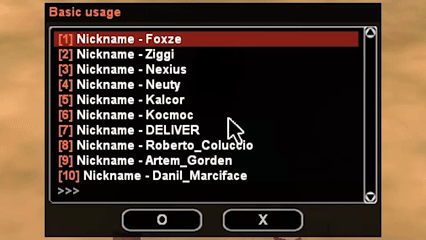
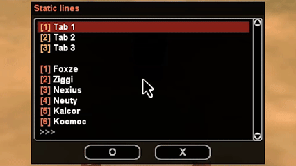

:u6e80: [English](/README.md) | [Russian](/README.ru.md)

:eyes: [Pawn-Wiki](https://pawn.wiki/index.php?/topic/63084-flip-dialog/#entry313669) | [open.mp](https://forum.open.mp/showthread.php?tid=6244)

# flip-dialog
A pagination system for dialogs in `SA-MP` & `open.mp` written in `Pawn`. It splits large amounts of text into dialog pages using different pagination modes.

Supported dialog styles: `DIALOG_STYLE_MSGBOX`, `DIALOG_STYLE_LIST`, `DIALOG_STYLE_TABLIST`, `DIALOG_STYLE_TABLIST_HEADERS`.

## Features
- Support [mdialog](https://github.com/Open-GTO/mdialog) (optional).
- Support [zlang](https://github.com/Open-GTO/zlang) (optional).
- Static lines on the first page.
- Manual mode for modules.

## Installation
Simply install the package into your project:
```txt
sampctl package install NikitaFoxze/flip-dialog
```

Include it in your code and start using the library:
```Pawn
#include <flip-dialog>
```

## Functions
<details>
<summary>Click to expand the list</summary>

**DialogPagin_Open(playerid, const function[], style, max_lines_on_page, const caption[], {Float, _}:...)**
> Open a dialog with pagination
> * `playerid` - The ID of the player opening the dialog
> * `style` - Dialogue style
> * `max_lines_on_page` - Maximum number of lines per page
> * `caption[]` - Dialogue title
> * Returns `1 (true)` if the function was successful, or `0 (false)` if the dialog was not opened

**DialogPagin_AddLine(playerid, color, const text[], {Float, _}:...)**
> Add a line
> * `playerid` - The ID of the player adding the line
> * `color` - Numbering color `[%i]`
> * `text[]` - Text of the line
> * Returns `1 (true)` if the function succeeded, or `0 (false)` if the line was not added

**DialogPagin_AddStaticLine(playerid, color, const text[], {Float, _}:...)**
> Add a static line
> * `playerid` - The ID of the player adding the static line
> * `color` - Numbering color `[%i]`
> * `text[]` - Text of the line
> * Returns `1 (true)` if the function succeeded, or `0 (false)` if the static line was not added

**DialogPagin_SetTablist(playerid, const text[], {Float, _}:...)**
> Add tab list (for `DIALOG_STYLE_TABLIST_HEADERS`)
> * `playerid` - The ID of the player adding the list of tabs
> * `text[]` - Tab list text
> * Returns nothing

**DialogPagin_SetLineID(playerid, abstractid)**
> Set abstract line ID (used with `DialogPagin_AddLine`)
> * `playerid` - The player ID that adds an abstract ID
> * `abstractid` - Abstract ID for further use
> * Returns `1 (true)` if the function succeeded, or `0 (false)` if no ID was specified

**DialogPagin_GetSelectLineID(playerid)**
> Return the ID of the line selected by the player, specified when it was added (used in `OnDialogResponse`)
> * `playerid` - The ID of the player receiving the abstract ID
> * Returns a previously added abstract ID

**DialogPagin_SetLineName(playerid, const abstract_name[])**
> Set an abstract name for a line (used with `DialogPagin_AddLine`)
> * `playerid` - The player ID that adds an abstract name
> * `abstract_name[]` - Abstract name for future use
> * Returns `1 (true)` if the function succeeded, or `0 (false)` if no name was specified.

**DialogPagin_GetSelectLineName(playerid, output[], const size = sizeof(output))**
> Return the name of the line selected by the player, specified when it was added (used in `OnDialogResponse`)
> * `playerid` - The ID of the player receiving the abstract name
> * `output[]` - Returned string with abstract name
> * `size` - String size
> * Returns nothing

**DialogPagin_ChangeCaption(playerid, const text[], {Float, _}:...)**
> Change the dialog title
> * `playerid` - The player's ID that changes the title
> * `text[]` - Headline text
> * Returns nothing

**DialogPagin_IsOpen(playerid, const function[] = "")**
> Check if a dialog with pagination is open (if using `mdialog`, the `Dialog_IsOpen` function will work correctly)
> * `playerid` - The ID of the player checking the dialog
> * `function[]` - Dialog function, optional argument
> * Returns `1 (true)` if a pagination dialog is open, or `0 (false)` if not.

**DialogPagin_GetTotalLines(playerid)**
> Return the number of all rows
> * `playerid` - The ID of the player receiving the number of lines
> * Returns the number of all rows

**DialogPagin_GetMaxLinesOnPage(playerid)**
> Reset the maximum number of lines per page
> * `playerid` - The ID of the player receiving the number of lines
> * Returns the maximum number of rows per page.

**DialogPagin_IsFirstPage(playerid)**
> Check for an open first page
> * `playerid` - The ID of the player receiving the page
> * Returns `1 (true)` if the first page is open, or `0 (false)` if not.

**DialogPagin_IsLastPage(playerid)**
> Check the last page that is open
> * `playerid` - The ID of the player receiving the page
> * Returns `1 (true)` if the last page is open, or `0 (false)` if not.

**DialogPagin_ReOpen(playerid)**
> Open the last closed dialog with pagination
> * `playerid` - The ID of the player opening the dialog
> * Returns `1 (true)` if the function was successful, or `0 (false)` if the dialog was not opened.

**DialogPagin_SetMode(playerid, modeid)**
> Set pagination mode (use before all functions)
> * `playerid` - The ID of the player opening the dialog
> * `modeid` - Pagination mode identifier (`FDIALOG_MODE_AUTO`, `FDIALOG_MODE_MANUAL`)
> * Returns nothing

**DialogPagin_ProcessManual(playerid, total_lines = 0)**
> Handle and open a dialog with manual mode (use in `OnDialogResponse`)
> * `playerid` - The ID of the player opening the dialog
> * `total_lines` - The total number of lines. If you don't enter anything, the maximum number of lines on the page plus 1 will be taken into account. If you enter the total number of lines, for example, from an array, it will also work.
> * Returns `1 (true)` if the function was successful, or `0 (false)` if the dialog was not opened.

**DialogPagin_ResetData(playerid)**
> Reset all pagination data if necessary
> * `playerid` - The player ID that is resetting the data
> * Returns nothing

</details>

## Basic usage
```Pawn
// If you want to change the text, just set these parameters
#define FDIALOG_TEXT_EMPTY "{FFFFFF}Empty..."
#define FDIALOG_TEXT_SELECT "O"
#define FDIALOG_TEXT_CLOSE "X"
#define FDIALOG_TEXT_NUMERATION "[%i]"

// For the DIALOG_STYLE_MSGBOX style
#define FDIALOG_MESSAGE_TEXT_NEXT "››"
#define FDIALOG_MESSAGE_TEXT_BACK "‹‹"

// For other styles
#define FDIALOG_LIST_TEXT_NEXT "{A0A0A0}>>>"
#define FDIALOG_LIST_TEXT_BACK "{A0A0A0}<<<"

#include <flip-dialog>

new nicknames[][MAX_PLAYER_NAME + 1] = 
	{
		"Foxze", "Ziggi", "Nexius", "Neuty", "Kalcor",
		"Kocmoc", "DELIVER", "Roberto_Coluccio", "Artem_Gorden",
		"Danil_Marciface", "VanilaSW", "Dima_Rendi", "Fix_Unvardo", "Itsuki_Yorimoto",
		"Flatt_Delx", "Fredorico_Viton", "Demetrio_Santini", "Maks_Anurov",
		"Vladislav_Barsov", "Doni_Visage", "Richi_Klay", "Sebastian_Undeground"
	};

CMD:fdtest(playerid) // Needs Pawn.CMD
{
	for (new i; i < sizeof(nicknames); i++) {
		DialogPagin_AddLine(playerid, 0xFF6347FF, // 0x00000000 - removes numbering
			"{FFFFFF}Nickname - %s",
			nicknames[i]);
	}

	DialogPagin_Open(playerid, Dialog:TestDialog, DIALOG_STYLE_LIST, 10,
		"{FF6347}Basic usage");

	return 1;
}

DialogResponse:TestDialog(playerid, response, listitem, inputtext[])
{
	if (!response) {
		// Your code...
		return 1;	
	}

	// Your code...
	return 1;
}
```


## Support [mdialog](https://github.com/Open-GTO/mdialog)
```Pawn
#include <mdialog>
#include <flip-dialog>

DialogCreate:TestDialog(playerid)
{
	for (new i; i < 100; i++) {
		DialogPagin_AddLine(playerid, 0xFF6347FF,
			"{FFFFFF}Number - %i", i);
	}

	DialogPagin_Open(playerid, Dialog:TestDialog, DIALOG_STYLE_LIST, 10,
		"{FF6347}Basic usage");

	return 1;
}

DialogResponse:TestDialog(playerid, response, listitem, inputtext[])
{
	if (!response) {
		// Your code...
		return 1;	
	}

	// Your code...
	return 1;
}
```

## Static lines
Static lines can only be added once per dialog. They appear only on the first page.
```Pawn
CMD:fdtest(playerid)
{
	DialogPagin_AddStaticLine(playerid, 0xFFAC55FF,
		"{FFFFFF}Tab 1");

	DialogPagin_AddStaticLine(playerid, 0xFFAC55FF,
		"{FFFFFF}Tab 2");

	DialogPagin_AddStaticLine(playerid, 0xFFAC55FF,
		"{FFFFFF}Tab 3");

	for (new i; i < sizeof(nicknames); i++) {
		DialogPagin_AddLine(playerid, 0xFF6347FF,
			"{FFFFFF}%s", nicknames[i]);
	}

	DialogPagin_Open(playerid, Dialog:TestDialog, DIALOG_STYLE_LIST, 10,
		"{FF6347}Static lines");

	return 1;
}

DialogResponse:TestDialog(playerid, response, listitem, inputtext[])
{
	if (!response) {
		// Your code...
		return 1;	
	}

	// Static lines
	if (DialogPagin_IsFirstPage(playerid)) {
		switch (listitem) {
			case 0: {
				SendClientMessage(playerid, -1, "Tab 1");
				return 1;
			}
			case 1: {
				SendClientMessage(playerid, -1, "Tab 2");
				return 1;
			}
			case 2: {
				SendClientMessage(playerid, -1, "Tab 3");
				return 1;
			}
		}
	}

	// Your code...
	return 1;
}
```


## Data storage for lines
Each line can be assigned an abstract ID or name, which allows one to determine what data the line the player selected contained.
```Pawn
CMD:fdtest(playerid)
{
	for (new i; i < sizeof(nicknames); i++) {
		DialogPagin_AddLine(playerid, 0xFF6347FF,
			"{FFFFFF}Nickname - %s", nicknames[i]);

		// The line is given the desired name.
		DialogPagin_SetLineName(playerid,
			nicknames[i]);
	}

	DialogPagin_Open(playerid, Dialog:TestDialog, DIALOG_STYLE_LIST, 10,
		"{FF6347}Data storage for lines");

	return 1;
}

DialogResponse:TestDialog(playerid, response, listitem, inputtext[])
{
	if (!response) {
		// Your code...
		return 1;	
	}

	new
		string[64],
		playerName[MAX_PLAYER_NAME + 1];

	// The name is taken from the line chosen by the player
	DialogPagin_GetSelectLineName(playerid, playerName);

	format(string, sizeof(string), "Select %s", playerName);
	SendClientMessage(playerid, 0xFFFFFFFF, string);
	return 1;
}
```

## Manual mode
Why use it? This mode is designed for working with huge amounts of text and situations where you need full control over the pagination process.

In manual mode, the pagination system displays only one page at a time and does not keep track of previous or next pages. You decide which page to display instead of passing the entire text array to the pagination system in advance.

This mode is also useful for loading data asynchronously in chunks: you can load a specific amount of data, display it, and then continue the pagination process after loading the next chunk.

In this mode, you need to declare your own variable to control the pagination `Offset`. The system does not know how many rows need to be processed in total: it only works with the current page and processes as many rows as you specify.

The system can only be provided with one of two states: whether there is a next page or there are no more pages.

**The first option** is to pass the array size to the `DialogPagin_ProcessManual` function, for example, `sizeof(nicknames)`, or the total number of rows.

**The second option** is to add one more line using `DialogPagin_AddLine` than can fit on a single page. This allows the pagination system to determine whether there is a next page when the total number of rows is unknown.

> **Note:** If you need to pause the current process in `DialogResponse` or open another dialog using `ShowPlayerDialog`, it is recommended to use `DialogPagin_ResetData`.
`DialogPagin_ResetData` is not required when `response` is `FDIALOG_RESPONSE_CLOSE` or `FDIALOG_RESPONSE_SELECT`, or when opening a dialog using `Dialog_Show` from `mdialog`.

This example demonstrates the first option, while the second option is available in `flip-dialog-mysql.inc`.
```Pawn
// Declaring a variable for offset
new
	test_offset[MAX_PLAYERS];

CMD:fdtest(playerid)
{
	// Setting the mode
	DialogPagin_SetMode(playerid, FDIALOG_MODE_MANUAL);

	DialogPagin_Open(playerid, Dialog:TestDialog, DIALOG_STYLE_LIST, 6,
		"{FF6347}Manual mode");

	return 1;
}

DialogResponse:TestDialog(playerid, response, listitem, inputtext[])
{
	// Declaring a variable for offset
	new
		start_offset,
		next_offset,
		max_lines_on_page = DialogPagin_GetMaxLinesOnPage(playerid);

	switch (response) {
		// Closing the dialog
		case FDIALOG_RESPONSE_CLOSE: {
			// Your code...
			return 1;
		}
		// Selecting a line
		case FDIALOG_RESPONSE_SELECT: {
			// Your code...
			return 1;
		}
		// First opening of the dialogue
		case FDIALOG_RESPONSE_INIT: {
			start_offset = 0;
			next_offset = max_lines_on_page;

			test_offset[playerid] = start_offset;
		}
		// Next page
		case FDIALOG_RESPONSE_NEXT_PAGE: {
			start_offset = test_offset[playerid] + max_lines_on_page;
			next_offset = start_offset + max_lines_on_page;

			test_offset[playerid] = start_offset;
		}
		// Previous page
		case FDIALOG_RESPONSE_BACK_PAGE: {
			start_offset = test_offset[playerid] - max_lines_on_page;

			if (start_offset < 0) {
				start_offset = 0;
			}

			next_offset = start_offset + max_lines_on_page;
			test_offset[playerid] = start_offset;
		}
	}

	new
		total_lines = sizeof(nicknames);

	// Adding lines
	for (new i = start_offset; i < next_offset && i < total_lines; i++) {
		DialogPagin_AddLine(playerid, 0xFF6347FF,
			"{FFFFFF}%s",
			nicknames[i]);
	}

	// Processing and displaying dialogue
	DialogPagin_ProcessManual(playerid, total_lines);
	return 1;
}
```

# flip-dialog-mysql
A separate manual mode module for loading data using the `LIMIT` clause in `MySQL queries`. Designed for convenient paginated loading without unnecessary logic.
```Pawn
#include <flip-dialog>
#include <flip-dialog-mysql>

CMD:fdtest(playerid)
{
	DPMySQL_Open(playerid, Dialog:TestDialog, DIALOG_STYLE_LIST,
		10, db_handle,
		"SELECT \
    		`nickname` \
		FROM `player_accounts` \
		ORDER BY `id` ASC",
		"Nicknames from the database");

	return 1;
}

DialogResponse:TestDialog(playerid, response, listitem, inputtext[])
{
	switch (response) {
		case FDIALOG_RESPONSE_CLOSE: {
			// Your code...
			return 1;
		}
		case FDIALOG_RESPONSE_SELECT: {
			// Your code...
			return 1;
		}
		case FDIALOG_RESPONSE_LOAD_DATA: {
			new
				playerName[MAX_PLAYER_NICKNAME + 1];

			for (new i; i < cache_num_rows(); i++) {
				cache_get_value(i, "nickname", playerName);

				DialogPagin_AddLine(playerid,
					0xFF6347FF,
					"{FFFFFF}%s",
					playerName);
			}
		}
	}

	DialogPagin_ProcessManual(playerid);
	return 1;
}
```
